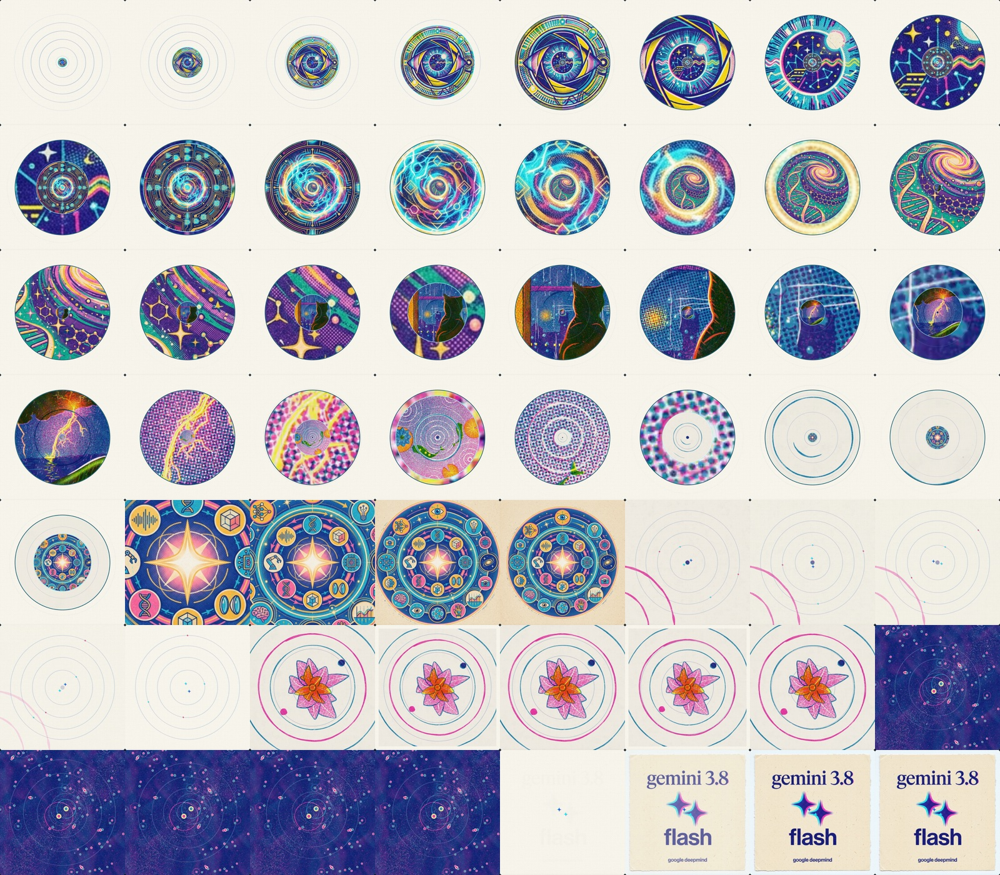
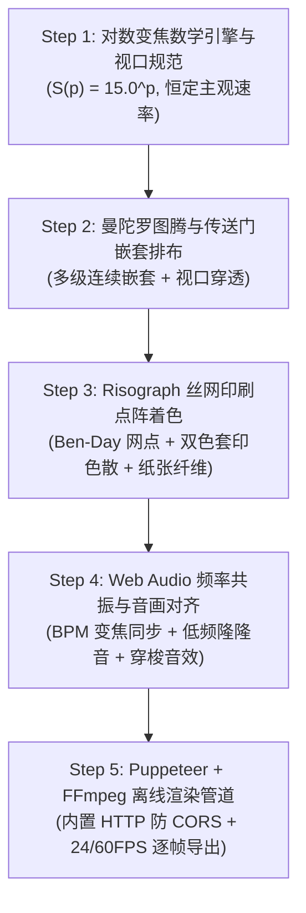
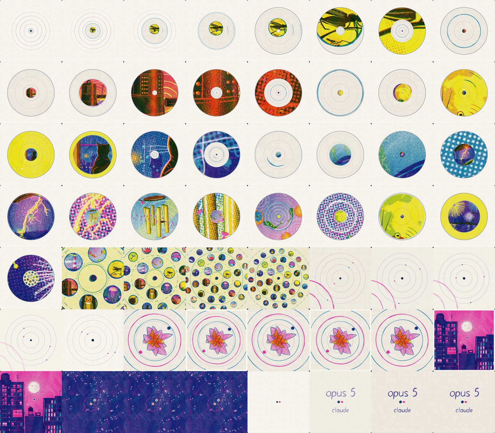

<p align="center">
  
</p>

<h1 align="center">Tree · JavaScript Infinite Zoom Video Skill</h1>

<p align="center">
  <strong>原生 JavaScript + HTML5 Canvas + WebGL 丝网印刷滤镜与 Headless 离线渲染 60FPS/24FPS 广播级无限变焦视频工业级 SOP</strong>
</p>

<p align="center">
  <a href="https://github.com/Tree-oil/Tree-JS-Infinite-Zoom-Video-Skill"></a>
  <a href="#license"></a>
  <a href="https://github.com/Tree-oil"></a>
  <a href="#installation"></a>
  <a href="#battle-tested-showcase"></a>
</p>

---

## 📖 Background & Technical Challenge (背景与技术痛点)

类似 **Claude Opus 5** 官方宣传片、**Gemini 3.8 Flash** 概念动画中的**复古丝网印刷 / Risograph 半色调点阵无限变焦（Infinite Zoom / Nested Portal Zoom）**视频，因其极强的纵深穿越感与复古版画质感，在科技圈和设计圈引发广泛赞叹。

然而，在前端与视频工程中实现此类效果，普遍面临以下技术难题：

1. **变焦速度不均匀（Perceived Velocity Jitter）**：
   - 线性缩放（$S(t) = 1 + c \cdot t$）会导致画面在初始阶段缩放迟钝，而在后期急速放大穿帮。
   - **解决方案**：必须采用**对数/指数归一化变焦方程**：$S(p) = \text{BASE\_SCALE}^p$（其中常用底数 $\text{BASE\_SCALE} \in [10.0, 20.0]$），确保在每一帧的人眼主观变焦感知速率严格恒定。

2. **多层嵌套坐标漂移（Nested Coordinate Drift）**：
   - 传送门穿越从第 $L$ 层过渡到第 $L+1$ 层时，如果直接叠放会导致图层边缘错位跳跃。
   - **解决方案**：建立标准全局变换矩阵，精准计算第 $k$ 级子图元相对于当前主视口的真实缩放率与中心漂移。

3. **浏览器 Canvas 离线污染（CORS Canvas Taint）**：
   - 本地 `file://` 协议下加载外部图片或纹理，会导致 Canvas 状态变为 Tainted，使得 Headless 离线帧截取（`toDataURL` / `getImageData`）直接报错被拦截。
   - **解决方案**：渲染管线内嵌轻量零依赖 HTTP 静态文件服务，保证绝对同源与资源无缝捕获。

4. **纯矢量图形的廉价感（Aesthetic Flatness）**：
   - 普通 Canvas 矢量线条单调生硬。
   - **解决方案**：注入 **Risograph 双色套印色散（Chromatic Misregistration）**、**Ben-Day 半色调点阵（Halftone Dot Screen）**与**未漂白特种纸纤维噪波（Paper Grain）**，还原纯正版画艺术质感。

---

## 🚀 Key Capabilities (核心能力)

- 🌀 **恒定感知速率变焦引擎**：基于 $S(p) = B^p$ 数学模型，支持无缝任意级嵌套传送门平滑变焦。
- 🎨 **物理级 Risograph 着色器**：
  - Dual-plate 双版错位套印（Offset $1\sim 2\text{px}$）与边缘油墨渗透。
  - Ben-Day 网点半色调调制（$45^\circ$ 经典版画旋转角度）。
  - 特种纸质底色（暖米白 `#F4F0E8` / 胚纸色 `#FAF6ED`）与多通道纤维噪波。
- 🖼️ **模块化图层解耦架构**：曼陀罗同心图腾、视觉之眼、神经微处理器、DNA 宇宙星云、最终品牌铭牌等元素即插即用。
- 🎬 **广播级无损离线渲染管道**：基于 Puppeteer-Core + 内部 HTTP 服务 + FFmpeg，单帧无抖动录制，支持 1080P/4K 60FPS / 24FPS MP4 极速导出。
- 🎵 **视听音效节奏编排**：内置 Web Audio API 低频变焦轰鸣（Sub-bass Drone）与多层音效同步。

---

## 🛠️ 5-Step Industrial Pipeline (5 步工业级 SOP)



### Step 1: 对数变焦数学引擎（Scale Core）
```javascript
// 每一层级的标准化缩放比例计算
const baseScale = 15.0; // 每一级缩放的几何倍率
function getLayerTransform(globalProgress, layerIndex) {
  const layerProgress = globalProgress - layerIndex;
  const scale = Math.pow(baseScale, layerProgress);
  // 当 scale < 0.05 或 scale > 80.0 时剔除或淡出，保证极致渲染性能
  const opacity = calculateFadeAlpha(scale);
  return { scale, opacity };
}
```

### Step 2: 曼陀罗图腾与传送门嵌套排布
- **基底图元**：同心圆环、对角线网格、神圣几何图案、复古刻度盘、放射性射线。
- **传送门（Portal Core）**：每个场景中心预留 $15\%\sim 25\%$ 半径的视觉锚点区域，作为下一个图层的嵌套发射井。

### Step 3: Risograph 丝网印刷网点滤镜
- **纸张基底**：暖米白纸张底色，叠加强度为 $6\%\sim 8\%$ 的微观纤维噪波。
- **Ben-Day 网点**：以 $45^\circ$ 倾角、空间频率 3~4px 计算二值化或多级点阵矩阵。
- **套印错位**：主色（如群青蓝 `#1B365D`、爱马仕橙 `#FF6600`、深铁黑 `#1A1A1A`）在 X/Y 方向偏移 $1.2\text{px}$，产生物理丝网印刷套版偏差。

### Step 4: Web Audio 音画对齐
- 构建包含双耳节拍、低频脉冲轰鸣（30Hz~60Hz Sub-bass）和高频颗粒声的程序化音轨。
- 缩放极值点与音效峰值毫秒级对齐。

### Step 5: Puppeteer + FFmpeg 离线无损渲染
- 自动启动本地静态服务器，彻底规避 `file://` 跨域与 Canvas 污染问题。
- Puppeteer 挂载 `window.renderFrame(frameIndex, totalFrames)` 逐帧精确截图。
- FFmpeg 管道直接吸纳无损 PNG 流，输出广播级 `H.264 / yuv420p` 高码率 MP4 视频。

---

## 🏆 Battle-Tested Showcase (实战验证案例)

### 案例 1：Claude Opus 5 官方无限变焦复刻
完整还原 Anthropic 官方 Claude Opus 5 宣传片中的几何图案、双色版画错位与连续缩放节奏。

<p align="center">
  
</p>

### 案例 2：Gemini 3.8 Flash 专属丝网印刷无限变焦
针对 Google Gemini 3.8 Flash 模型定制设计的 5 层连续嵌套史诗变焦动画：
1. **Layer 1: Gemini 神圣曼陀罗（Sacred Mandala）**
2. **Layer 2: 多模态视界之眼（Multimodal Vision Eye）**
3. **Layer 3: 神经张量处理核心（TPU Neural Core）**
4. **Layer 4: 双螺旋代码宇宙（DNA Code Cosmos）**
5. **Layer 5: 最终品牌铭牌（Gemini 3.8 Flash Finale Card）**

<p align="center">
  
</p>

---

## 📂 Repository Structure (仓库目录结构)

```text
Tree-JS-Infinite-Zoom-Video-Skill/
├── .gitignore
├── LICENSE
├── README.md
├── SKILL.md                               # Skill 入口与工业 SOP 规范
├── assets/                                # 预览图与效果展示
│   ├── hero.jpg                           # Gemini 3.8 Flash 实战联排图
│   └── opus5_reproduced_sheet.jpg         # Claude Opus 5 复刻联排图
└── skills/
    └── js-infinite-zoom-video/
        ├── SKILL.md                       # 标准 5 步工业级 SOP
        ├── references/
        │   ├── infinite_zoom_math.md      # 对数变焦数学推导与坐标变换
        │   └── risograph_palette_guide.md # Risograph 丝网印刷色彩与网点规范
        ├── templates/
        │   ├── engine_template.js         # InfiniteZoomEngine 开箱即用引擎类
        │   └── riso_shader_template.js    # RisoRenderer WebGL/Canvas 版画滤镜
        └── scripts/
            └── render_pipeline.js         # Puppeteer + FFmpeg 离线 24/60FPS 渲染管线
```

---

## 📥 Installation (安装方式)

### 1. One-Command Install for OpenAI Codex
全局安装到当前用户的 Codex 会话环境：
```bash
gh skill install Tree-oil/Tree-JS-Infinite-Zoom-Video-Skill js-infinite-zoom-video --agent codex --scope user
```

或安装到当前项目：
```bash
gh skill install Tree-oil/Tree-JS-Infinite-Zoom-Video-Skill js-infinite-zoom-video --agent codex --scope project
```

### 2. Google Antigravity
克隆或复制技能目录到 Antigravity 全局 skills 文件夹：
```bash
mkdir -p ~/.gemini/config/skills/
git clone https://github.com/Tree-oil/Tree-JS-Infinite-Zoom-Video-Skill.git /tmp/skill-repo
cp -r /tmp/skill-repo/skills/js-infinite-zoom-video ~/.gemini/config/skills/
```

### 3. Claude Code & Cursor
直接将仓库作为 submodule 或目录添加至根目录 `.agents/skills/`：
```bash
git submodule add https://github.com/Tree-oil/Tree-JS-Infinite-Zoom-Video-Skill.git .agents/skills/js-infinite-zoom-video
```

---

## 💬 Usage Prompt Examples (使用指令示例)

在任意具备 Skill 能力的 AI Agent 对话中，使用自然语言即可唤起：

```text
帮我用 JavaScript 制作一个类似 Claude Opus 5 的复古丝网印刷无限变焦动画。
要求使用对数变焦数学引擎，加入 Risograph 半色调网点滤镜，并在核心嵌套 4 层科技图腾，最后导出 1080P 24FPS MP4 视频。
```

或者在 Codex / Antigravity 中显式调用：
```text
Use $js-infinite-zoom-video to construct a 5-tier nested portal zoom animation with Ben-Day halftone screenprint shaders and render it via the offline headless Puppeteer pipeline.
```

---

## 📄 License

Distributed under the [MIT License](./LICENSE).

---

<p align="center">
  <strong>Tree Personal IP · Skill Series</strong><br/>
  <sub>Created with passion for high-production JavaScript generative art & audio-visual animation engineering.</sub><br/>
  <sub>Contact: joker218313@gmail.com</sub>
</p>
