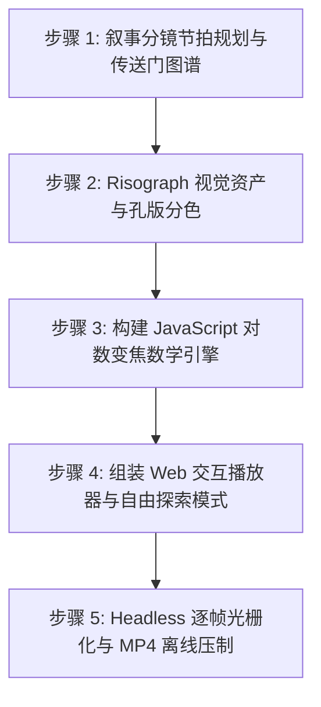

# JavaScript 无限变焦与 Risograph 动画视频制作指南

无限变焦（Infinite Zoom）与复古 Risograph（丝网孔版印刷）半色调艺术结合，能够产生极具深度感、视觉催眠力与艺术品质的动画体验（如经典 Claude Opus 5 声音曼陀罗或 Gemini 3.8 Flash 多模态宇宙）。

本 Skill 将这一工作流沉淀为 **「标准 5 步工业级 SOP」**，兼顾 **浏览器端 60 FPS 实时交互漫游** 与 **Node.js 离线 24 FPS 广播级 1080p MP4 视频压制**。

---

## 快速导航与工具库

- **可复用模板 (Templates)**：
  - [通用无限变焦引擎模板](./templates/engine_template.js) (`InfiniteZoomEngine`)
  - [Risograph 滤镜与半色调着色器模板](./templates/riso_shader_template.js) (`RisoRenderer`)
- **自动化脚本 (Scripts)**：
  - [Headless Chrome + FFmpeg 离线渲染管道](./scripts/render_pipeline.js)
- **底层原理参考 (References)**：
  - [无限变焦对数坐标与视锥变换数学推导](./references/infinite_zoom_math.md)
  - [Risograph 经典油墨调色盘与网点角度指南](./references/risograph_palette_guide.md)

---

## 标准执行 SOP 流程（5 步工作流）



---

### 步骤 1：叙事分镜节拍规划与传送门图谱 (Scene Graph & Timing)

1. **确定时间轴与音频对齐**：
   - 典型短片时长设定为 28~30 秒，帧率统一为 24 FPS（总帧数 $\approx 672$ 帧）。
   - 导入节拍音轨（如 `audio.mp3`），在时间轴上标定关键音频重音（Punches/Drops）。
2. **构建嵌套传送门拓扑（Portal Graph）**：
   - 定义每一幕的开始时间 `startTime`、结束时间 `endTime`。
   - 标定每一幕内部下一场景进入的“传送门锚点”：
     ```javascript
     {
       id: 'vision_iris',
       name: '万物之眼',
       startTime: 2.2,
       endTime: 4.8,
       portal: { x: 540, y: 540, radius: 28 }, // 嵌套下一场景的几何中心与半径
       texture: 'gemini_vision_eye'
     }
     ```
3. **编排三大高潮节点**：
   - **前奏（0s~2.5s）**：单点微光/声波同心环扩散，首个传送门膨胀打开。
   - **拉远高潮（全景曼陀罗 16s~18s）**：镜头突然拉远（Zoom Out），展示由 36 个图腾环绕的天体星盘。
   - **终幕收敛（26s~28s）**：星盘收缩为同心公转双星粒子，定格在品牌手绘印章（Brand Mark）。

---

### 步骤 2：Risograph 视觉资产与孔版分色 (Visual Assets & Riso Palette)

1. **色彩与油墨分离**：
   - 遵循四色或双色丝网印刷原则，严禁使用杂乱的渐变色。
   - 推荐使用高反差经典版位：
     - **主轮廓与阴影**：Federal Blue（`#1B2A4A` / `#0B132B`）
     - **能量光环与波纹**：Electric Cyan（`#00F0FF` / `#0077B6`）
     - **情感焦点与高光**：Fluorescent Pink（`#FF2A6D`）
     - **逻辑脉冲与神圣几何**：Sunflower Gold（`#FFB703`）
2. **纸张材质底色**：
   - 使用未漂白棉质暖色纸张（`#FAF7EE`），严禁使用死白的 `#FFFFFF`。
   - 叠加细微的离屏微噪点与散落纸浆纤维（Fiber Flecks）。
3. **半色调网点（Ben-Day Halftone Dots）**：
   - 预生成 12px 离屏网点 Pattern，通过 `globalCompositeOperation = 'multiply'` 叠印在整体画幅上。
4. **套印错位（Misregistration Offset）**：
   - 为青色版赋予 $(-1.5\text{px}, -1.0\text{px})$ 的位移，为洋红版赋予 $(+1.5\text{px}, +1.0\text{px})$ 的位移，模拟手工双滚筒印刷的物理公差。

---

### 步骤 3：构建 JavaScript 对数变焦数学引擎 (Mathematical Zoom Engine)

1. **拒绝线性插值，采用指数尺度**：
   - 单级传送门缩放跨度比固定为 $K = \frac{R_{\text{outer}}}{R_{\text{portal}}} \approx 15.0$。
   - 在当前场景进度 $p \in [0, 1]$ 下，瞬时缩放比例为：
     $$\text{scale}(p) = 15.0^p$$
2. **两级场景平滑绘制**：
   - 当前场景以 $\text{scale}(p)$ 在外圈圆环（$R = 410\text{px}$）遮罩内绘制。
   - 下一场景以 $\frac{\text{scale}(p)}{15.0}$ 嵌套在中心传送门内实时同步放大。
   - 当 $p \to 1$ 时，下一场景尺度自然扩张为 $1.0$，实现视觉“绝对零跳变”的平滑交接。
3. **同心波纹与粒子系统**：
   - 在中心锚点处绘制实时放射的同心声波圆环。
   - 在曼陀罗解构阶段，驱动双星粒子沿同心轨道公转：
     $$x = cx + r \cdot \cos(\omega t), \quad y = cy + r \cdot \sin(\omega t)$$

---

### 步骤 4：组装 Web 交互播放器与自由探索模式 (Interactive Web Player)

1. **自适应视口**：
   - 将 1080×1080 正方形 Canvas 封装在 `aspect-ratio: 1 / 1` 的容器内，保证在各类屏幕自适应居中。
2. **控制栏功能**：
   - **播放/暂停**：同步驱动 `requestAnimationFrame` 与 `HTMLAudioElement`。
   - **时间轴拖拽（Scrubber）**：通过 `<input type="range">` 随时 seek 到任意时间戳。
   - **倍速播放**：调节 `engine.playbackRate` 与 `audio.playbackRate`。
   - **声音开关**：支持一键静音/解除静音。
3. **自由漫游模式（Free-Roam Mode）**：
   - 监听 Canvas `mousedown / mousemove` 实现画布拖拽平移。
   - 监听 `wheel` 事件实现滚轮无极缩放，允许观众暂停视频后自由“用显微镜”观察每一个微缩图腾细节。

---

### 步骤 5：Headless 逐帧光栅化与 MP4 离线压制 (Headless Video Export)

1. **防 CORS 画布污染**：
   - 浏览器本地直接读取 `file://` 图片会导致 Canvas Taint 无法提取像素。
   - 必须通过 Node.js 内置 `http` 模块在本地临时启动静态服务（如 `http://localhost:8095/`）。
2. **确定性帧步进（Deterministic Frame Stepping）**：
   - 严禁依赖实时录屏，必须通过无头浏览器逐帧调用：
     ```javascript
     for (let i = 0; i < totalFrames; i++) {
       const t = i / fps;
       await page.evaluate((timestamp) => window.__engine.renderFrame(timestamp), t);
       const buffer = await canvas.screenshot({ type: 'png' });
       ffmpeg.stdin.write(buffer);
     }
     ```
3. **FFmpeg 管道流封装**：
   - 接收 `image2pipe` 像素流，结合音频源 `audio.mp3`，采用 `libx264` 编码器以 `-crf 18` 高清标准直出 1080×1080 原生 MP4 文件。

---

## 核心避坑指南 (Troubleshooting)

| 异常现象 | 根本原因 | 解决方案 |
| :--- | :--- | :--- |
| **Canvas 报错 SecurityError: Tainted canvas** | 直接通过 `file://` 打开带有外部图片的网页导致跨域安全拦截 | 启动 Node.js 临时 HTTP 静态服务器或配置 `--allow-file-access-from-files` |
| **变焦卡顿、临近时突然加速** | 错误地使用了线性缩放 $S = 1 + k \cdot t$ | 严格采用对数/指数比例缩放 $S = 15.0^p$ |
| **高分辨率下网点频闪走样 (Moire Effect)** | 半色调点阵采样率与渲染像素网格产生摩尔纹干涉 | 在半色调点阵外层施加微小的模糊（Blur: 0.5px）或固定点阵尺寸为屏幕整数倍 |
| **上一场景突然凭空消失** | 场景交接时层级切换过早 | 维持双缓冲嵌套渲染，上一场景需放大至完全超出视口外圈后方可剔除 |
