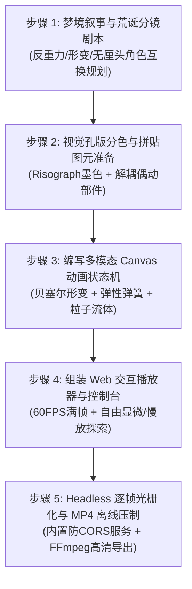

# 原生 JavaScript 梦幻超现实创意动画视频制作指南

纯代码（原生 JavaScript + HTML5 Canvas / WebGL）不仅能完成几何数学缩放，更能创造充满**梦幻感、无厘头哲学隐喻、超现实形变流转与定格拼贴偶动**的先锋视觉艺术短片（如《庄周梦蝶》荒诞变奏、Claude 5 声音宇宙、Gemini 多模态星系等）。

本 Skill 提供通用的代码动画创作体系，拒绝千篇一律的单一圆环推进，兼顾 **浏览器端 60 FPS 实时交互漫游** 与 **Node.js 离线 24 FPS 广播级 1080p MP4 视频压制**。

---

## 快速导航与工具库

- **动画语法与底层原理 (References)**：
  - [超现实无厘头动画语法指南](./references/surreal_animation_grammar.md)（形变流转、拼贴偶动、荒诞物理、撕纸转场、打破第四面墙）
  - [无限变焦对数坐标与视锥变换数学推导](./references/infinite_zoom_math.md)
  - [Risograph 经典油墨调色盘与网点角度指南](./references/risograph_palette_guide.md)
- **开箱即用模板 (Templates)**：
  - [先锋抽象与连续流变数学引擎模板](./templates/abstract_stream_template.js) (`AbstractStreamRenderer`)
  - [纯代码程序化东方图腾生成模板](./templates/procedural_art_template.js) (`ProceduralArt`)
  - [通用无限变焦引擎模板](./templates/engine_template.js) (`InfiniteZoomEngine`)
  - [Risograph 滤镜与半色调着色器模板](./templates/riso_shader_template.js) (`RisoRenderer`)
- **自动化离线压制 (Scripts)**：
  - [Headless Chrome + FFmpeg 离线渲染管道](./scripts/render_pipeline.js)

---

## 通用工业级创作 SOP（5 步流程）



---

### 步骤 1：梦境叙事与荒诞分镜剧本 (Surreal Script & Timing)
1. **打破常规现实逻辑**：
   - 动画的魅力在于“意料之外，情理之中”。设计让观众会心一笑或惊叹的视觉隐喻：
     - 打瞌睡时头顶像茶壶般掀开，飞出扑棱翅膀的生灵。
     - 茶水反重力悬浮，凝结成鱼在空中游动。
     - 角色突然打破第四面墙转头盯住观众，头顶跳出大问号“？？？”。
2. **标定节拍与转场类型**：
   - 不局限于同心圆缩放！综合运用：
     - **形变流转（Morphing）**：A 物体边缘液化成 B 物体。
     - **撕纸转场（Torn Paper）**：画面中央撕开，露出下一维度的宇宙。
     - **天外飞印（Slam Stamp）**：巨大的朱砂红印章从天而降，伴随激烈震屏，一锤定音。

---

### 步骤 2：视觉孔版分色与拼贴图元 (Risograph & Collage Assets)
1. **古典版画与丝网孔版质感**：
   - 严禁死白与杂乱数码渐变，采用 **未漂白特种纸底色（#FAF7EE 或 #F7F2E7）**。
   - 选用高反差矿物墨色：松烟玄墨（`#16191E`）、辰溪朱砂（`#E84A3B`）、石青（`#1D6A86`）、泥金（`#F3A712`）。
   - 叠印 45° Ben-Day 半色调点阵与 1.2px 物理双版套印错位（Misregistration）。
2. **解耦部件拼贴**：
   - 为实现特里·吉列姆式的偶动，将角色拆分为身体、头盖骨、翅膀、眼皮等可动图元。

---

### 步骤 3：编写多模态 Canvas 动画状态机 (Animation Engine)
1. **弹簧弹性振荡模型 (Damped Spring Physics)**：
   ```javascript
   function springWobble(t, freq = 8, decay = 3) {
     return Math.sin(t * freq) * Math.exp(-decay * t);
   }
   ```
2. **震屏与冲击波 (Screen Shake)**：
   ```javascript
   function getScreenShake(impactTime, currentTime, intensity = 14) {
     const elapsed = currentTime - impactTime;
     if (elapsed < 0 || elapsed > 0.45) return { x: 0, y: 0 };
     const damp = (0.45 - elapsed) / 0.45;
     return {
       x: (Math.random() - 0.5) * intensity * damp,
       y: (Math.random() - 0.5) * intensity * damp
     };
   }
   ```
3. **复合转场管线**：
   - 将缩放、平移、撕纸齿线、粒子生成和实体印章组合进当前时间戳 `renderFrame(t)` 统一驱动。

---

### 步骤 4：组装 Web 交互播放器 (Interactive Player)
- 1080×1080 响应式 Canvas。
- 提供播放/暂停、倍速切换（0.5x~2.0x）、时间轴拖拽（Seek）。
- 提供“显微漫游”模式：允许用户随时暂停动画，用鼠标滚轮放大至 50 倍观察局部微观手绘图腾。

---

### 步骤 5：Headless 逐帧光栅化与 MP4 离线压制 (Headless Export)
- 启动本地 Node.js HTTP 静态服务器（防止 Canvas 跨域污染）。
- Puppeteer 挂载 `window.__engine.renderFrame(t)` 逐帧抓取无损 PNG。
- 管道流送入 FFmpeg，以 `-crf 18` 高清标准压制输出 1080×1080 24/60FPS MP4 文件。
